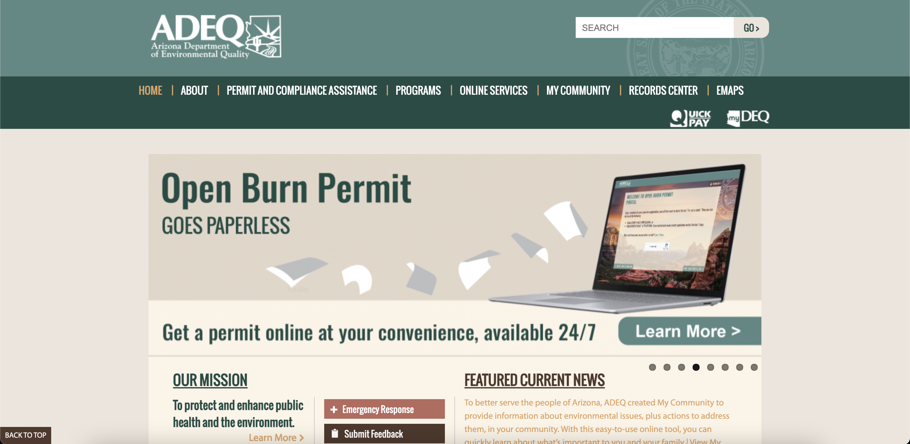
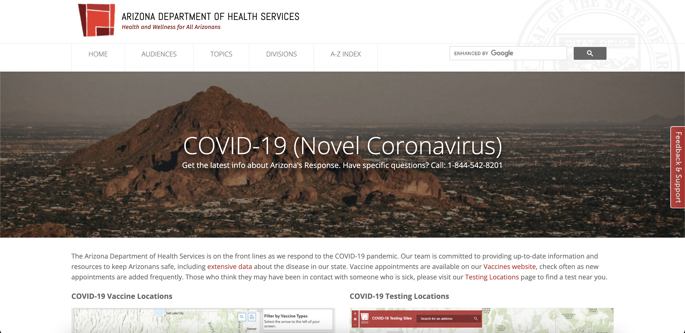

# Assignment 01: Heuristic Evaluation - Anika Murthy, DH 110
## Feed the Planet
Growing up a vegetarian, I've always felt an undeniable connection to my surrounding environments. I believe in nourishing our surroundings and fostering environmental consciousness – our planet is our home and for the myriad of roles it serves us, it deserves our utmost respect and care. With time, I've grown to understand the importance of acts we can partake in to prevent the deterioration of our respective environments, especially those pertaining to public health and conscious acts of environmental service. 

To fuel my desire of preserving our planet by taking small steps like pioneering change in our immediate communities, I've chosen to center this project around the Arizonian government's various environmentally-related facets. Through the development of this project and its foundational research, I want to contribute to the creation of a delightful website that contains all of Arizona's environmental projects and initiatives, as well as houses an online community for locals to interact, collaborate, and further the preservation of their communities.  

To support this assignment, I have referenced two sources: [10 Usability Heuristics for User Interface Design](https://azdeq.gov/) and [Severity Ratings for Usability Problems](https://www.nngroup.com/articles/how-to-rate-the-severity-of-usability-problems/). By utilizing these tools of analyses with a target audience of Arizonian adults in mind, I have carried out a comprehensive heuristic evaluation of Arizona's [Department of Environmental Quality](https://azdeq.gov/) and [Department of Health Services](https://www.azdhs.gov/index.php), both of which detail issues of public and enviromental health within the state. 

#### Scale
This rating scale will be utilized throughout the following heuristic evaluations in order to assess the severity of usability issues. 
| Rating | Description |
|---|---|
| 0 | No usability problems |
| 1 | Cosmetic problem only: need not be fixed unless extra time is available on project |
| 2 | Minor usability problem: fixing this should be given low priority |
| 3 | Major usability problem: important to fix, so should be given high priority |

## [Department of Environmental Quality](https://azdeq.gov/) 

#### Preface
The ADEQ is Arizona's Department of Environmental Quality. This branch of the state "administers the state’s environmental laws and delegated federal programs to prevent air, water and land pollution and ensure cleanup" (ADEQ). Their website is sorted by three environmental programs: Air Quality, Water Quality and Waste, with functional units responsible for technical, operational and policy support. A typical user of this site might be a citizen of Arizona seeking environmental resources to strive for change, information regarding the state's environmental history, or hearings within the community. 

#### Heuristic Evaluation
_Overall_: This website is strong in its application of aesthetic and minimalist design. The standard UI displays information in a relatively clear manner, making it easily navigatable to a variety of users, especially the target audience of Arizonian citizens. However, it could use strong improvement in its help & documentation, as well as error prevention, both of which factors restrict the user journey and experience.

| Heuristic & Description                                                                                                                                                     | Evaluation                                                                                                                                                                                                                                                                                                                                                                                                                                                                                                                                                                                                            | Potential Fixes                                                                                                                                                                                    | Severity of "Bad" Element(s) |
| --------------------------------------------------------------------------------------------------------------------------------------------------------------------------- | --------------------------------------------------------------------------------------------------------------------------------------------------------------------------------------------------------------------------------------------------------------------------------------------------------------------------------------------------------------------------------------------------------------------------------------------------------------------------------------------------------------------------------------------------------------------------------------------------------------------- | ------------------------------------------------------------------------------------------------------------------------------------------------------------------------------------------------------------------- | ------------------------- |
| **1\. Visibility of system status** The website efficiently updates users of its current status.                                                                            | **Good**: Upon hover, the site highlights the page that the user is on via the top navigation bar. **Bad**: The site is inconsistent in the way that it displays hyperlinks – some are underlined upon hover, while others don't appear clickable. **Bad**: The site does not always indicate to users where they are; deeply sifting through a sub-page may result in the user being unaware of their place on the site.                                                                                                                                                                                                                                                                                                          | In order to maintain consistency and update users of its current status, the site should have every selected page/link either highlighted or underlined.                                                                                                                                                                                  | 2                         |
| **2\. Match between system and the real world** The website presents information in a logical order in a language that is familiar to the user and adheres to real-world conventions. | **Good**: The site uses intuitive key-words such as "My Community", "Our Mission", and "Programs", all of which are in line with modern language conventions. **Bad**: The menu option "Compliance Assistance" is not familiar language to all and is not defined anywhere on the site.                                                                                                                                                                                                                                                                                                                                                                                                     | Define the service of "Compliance Assistance" and its pertinance to Arizona's environmental health initiatives.                                                                                           | 1                         |
| **3\. User control and freedom** The website allows for users to undo unwanted actions with ease.                                                                           | **Good**: The site displays a "Return to the previous page" button each time a user navigates through different sub-pages, allowing them to return to their original position. **Good**: The search bar easily allows users to change their queries and also presents an "advanced search" option if a query yields no results.                                                                                                                                                                                                                                                                                                                                                                                                     | No recommendations for user control & freedom.                                  | 0                         |
| **4\. Consistency and standards** The website is in alignment with industry conventions.                                                                             | **Good**: The site contains both a top navigation bar and a footer located in appropriate locations with predictable information/tabs. **Good**: The site includes a "Back to Top" button to seamlessly guide users back to the top of a page. **Bad**: Certain pages on the site include sidebars with redundant information, as well as new sub-pages that aren't part of the main navigation.                                                                                                                                                                                                                                                                                                                                                                                                                                                                                           | Organize information from various sidebars into main navigation menu to avoid confusion and disarray.                                                                                                                                                                                 | 1                         |
| **5\. Error prevention** The website eliminates error-prone conditions and mitigates potential erros through the employment of confirmation actions.                                          | **Good** In the case that a user inputs a search that yields no results, the website offers potential related searches and keywords to help the user locate the appropriate information. **Bad**: The website does not have any confirmation actions and broken links on specific sub-pages do not display error messages, but rather, lead you back to the sub-page.                                                                                                                                                                                                                                                                                                                                                                                                                          | Consistently display error messages  consistently across the site for any broken links and employ confirmation actions to inform the user of their status.                                                                                             | 2                         |
| **6\. Recognition rather than recall** The website displays information that is vital to the user journey in an accessible manner.                                        | **Good**: Each sub-page of the site contains a footer with resources that are related to the theme of the sub-page and are to be used as reference to better understand the information at hand. **Bad**: There is no fluidity across the website's various pages – due to the assortment of hyperlinks and sub-categories, each sub-page functions as its own mini-site, making it difficult to recognize motifs. | Make the resources footer more accesible and provide concise guides on how to combine information across the website to maximize your user journey. Display a summary of each sub-page's scope and note its relation to other pages. | 3                         |
| **7\. Flexibility and efficiency of use** The website is tailored to the user and inclusive of varying levels of expertise.                                                     | **Good**: The website follows a standard UI – "Learn More" buttons are consistently employed across the site and there are no hidden pieces of information. **Bad**: The website is not customizable to the user's needs and nor are there any usable shortcuts, making it less inclusive to the expert user.                                                                                                                                                                                                                                                                                                                                                                                                    | Allow for customizable functionalities and keyboard shotcuts to provide expert users with an efficient experience.                                                                                                                                      | 1                         |
| **8\. Aesthetic and minimalist design** The website is only comprised of relevant information and is built to highlight these units.                                   | **Good**: The website contains a comprehensive sidebar with "Frequently Viewed" sub-pages/links, making it easy to access common resources and highlighting the site's most relevant units of information. (Example Book).                                                                                                                                                                                                                                                                                                                                                                                                                                                                    | No recommendations for aesthetic & minimalist design.                                                                                                                                                                                 | 0                         |
| **9\. Help users recognize, diagnose, and recover from errors** The website presents clear error messages that indicate and solve any potential problems.                   | **Good**: The site displays a standard 404 message upon navigation of a broken link. **Bad**: The site's 404 error messages do not describe why the link may be invalid and does not provide active solutions to further the user's journey.                                                                                                                                                                                                                                                                                                              | Inform the user of what inputs may be invalid and suggest other links that may be of use.                                                                                | 1                         |
| **10\. Help and documentation** The website holds documentation and resources to guide users through their journey.                                                                    | **Bad**: The "Contact" page is not displayed on the main navigation, but rather, the footer, making it less accessible. **Bad**: The main navigation menu contains a "Online Services" page, which contains the branch's contact info which is different from the resources displayed in the official "Contact" page.                                                                                                                                                                                                                                                                            | Make the "Contact" page more easily accesible and keep the contact information consistent across the site.                          | 2                         |

## [Department of Health Services](https://www.azdhs.gov/index.php) 

#### Preface
The AZDHS is Arizona's Department of Health Services. The branch itself spans a variety of public health-related disciplines, including, but not limited to: COVID-19, Health Screenings, Immunizations, etc. As stated by the AZDHS, their mission is to "promote, protect, and improve the health and wellness of individuals and communities in Arizona." The site includes information that is relevant to a myriad of groups such as: women, men, children & teens, seniors, clinicians, school representatives, Spanish speakers, and veterans, making the target audience a mélange of Arizonian citizens who may want to access health-related resources.

#### Heuristic Evaluation
_Overall_: This website is well-tailored for an Arizonian citizen to access health-related resources – the UI is clean and minimal and the information is displayed in an easily navigable manner. Although the site is a little bit on the denser side in regards to the amount of resources it holds, it is well-organized and its adherance to the visibility of system status makes the user journey more seamless. The site's shortcomings lie in its recognition, diagnosis, and recovery of/from errors, in which it could use some help in redirecting users and efficient problem-solving.

| Heuristic & Description                                                                                                                                                     | Evaluation                                                                                                                                                                                                                                                                                                                                                                                                                                                                                                                                                                                                            | Potential Fixes                                                                                                                                                                                    | Severity of "Bad" Element(s) |
| --------------------------------------------------------------------------------------------------------------------------------------------------------------------------- | --------------------------------------------------------------------------------------------------------------------------------------------------------------------------------------------------------------------------------------------------------------------------------------------------------------------------------------------------------------------------------------------------------------------------------------------------------------------------------------------------------------------------------------------------------------------------------------------------------------------- | ------------------------------------------------------------------------------------------------------------------------------------------------------------------------------------------------------------------- | ------------------------- |
| **1\. Visibility of system status** The website efficiently updates users of its current status.                                                                            | **Good**: The site highlights each link/sub-page in a distinct red color upon hover. **Good**: The drop-down menu that appears upon hover on the main navigation menu is also displayed when a user selects a specific page, making it easy to navigate between sub-pages. **Bad**: Apart from a heading title on each page noting the category, a selected sub-page does not remain highlighting, which may make it difficult for a user to remember their position on the site.                                                                                                                                                                                                                                                                                                           | Underline or highlight the selected tab on the main navigation menu.                                                                                                                                                                                 | 1                         |
| **2\. Match between system and the real world** The website presents information in a logical order in a language that is familiar to the user and adheres to real-world conventions. | **Good**: The website's presentation, as well as language, is clear and concise and makes use of familiar words. **Good**: Each sub-page includes a comprehensive description of its purpose and is worded intuitively.                                                                                                                                                                                                                                                                                                                                                                                                      | No recommendations for match between system and real world.                                                                                           | 0                         |
| **3\. User control and freedom** The website allows for users to undo unwanted actions with ease.                                                                           | **Good**: Each page contains a sidebar with a set of links pertaining to the category which users can use to return to their desired positions in the case of an unwanted click. **Bad**: The site has "Find What You're Looking For" drop-down selection menu, but does not include a "Go" or "Confirm" button, immediately leading users to a new page for a category that they may have accidentally clicked on.                                                                                                                                                                                                                                                                                                                                                                                                    | Add a "Go" or "Confirm" button after this drop-down menu so users have the ability to undo misclicks.                                    | 2                         |
| **4\. Consistency and standards** The website is in alignment with industry conventions.                                                                             | **Good**: The site contains a main navigation menu, as well as a footer, both of which hold relevant and unique information that further the user journey. **Good**: Clicking on the distinct logo located next to the website's heading title takes users back to the home page.                                                                                                                                                                                                                                                                                                                                                                                                                                   | No recommendations for consistency and standards.                                                                                                                                                                                 | 0                         |
| **5\. Error prevention** The website eliminates error-prone conditions and mitigates potential erros through the employment of confirmation actions.                                          | **Good**: The website's navigation is displayed on every part of the site – no matter which page a user is on or where a user clicks, they will always be able to find their way back to their original position. **Good**: There is an A-Z index so that users can easily access resources based on a specific query that is already in mind.  **Bad**: There is no button or icon for users to go back to a previous page, resulting in more clicks and a less efficient journey.                                                                                                                                                                                                                                                                                                                                                                                                                                                     | Incorporate a "Back" button, symbol, or icon to improve the flow.                                                                                              | 1                         |
| **6\. Recognition rather than recall** The website displays information that is vital to navigation in an accessible manner.                                        | **Good**: Each page on the site contains a distinct header, making it clear to the user exactly where they are and what information they can access at this point of their journey. **Bad**: There are many ways to get to a specific position, making it difficult for a user to go back or understand how they got to a certain point of their journey. | Display small heading text explaining to the user the specific clicks and manner of navigation that brought them to their current position. | 2                         |
| **7\. Flexibility and efficiency of use** The website is tailored to the user and inclusive of varying levels of expertise.                                                     | **Good**: The search bar as well as A-Z index makes information easily accessible and keeps users from having to sift through the entirety of the site to locate a single unit of information. **Bad**: The website's advanced capabilities are very arbitary and vague, making it less inclusive to the expert user.                                                                                                                                                                                                                                                                                                                                                                                                     | Make the scope of functionalities clearer and incorporate shortcuts.                                                                                                                                      | 1                         |
| **8\. Aesthetic and minimalist design** The website is only comprised of relevant information and is built to highlight these units.                                   | **Good**: The website contains a set of links by the title of "Most Popular", making it clear to the user what the site's most relevant information is and where it is located. **Good**: The site utilizes a consistent monochromatic palette and leverages depth and contrast through these two colors.                                                                                                                                                                                                                                                                                                                                                                                                                                                                                                             | No recommendations for aesthetic and minimalist design.                                                                                                                                                                                 | 0                         |
| **9\. Help users recognize, diagnose, and recover from errors** The website presents clear error messages that indicate and solve any potential problems.                   | **Good**: The website displays clear error messages such as "Page or Document Not Found" when a user enters a broken link. **Bad**: Upon displaying an error message, the site automatically redirects you to the homepage with no option to return to your previous position, resulting in the loss of progress.                                                                                                                                                                                                                                                                                                              | Present an option to go back and change the redirection to be manual rather than automatic.                                                                                | 3                         |
| **10\. Help and documentation** The website holds documentation and resources to guide users through their journey.                                                                    | **Good**: The "Contact" page located in the footer holds a comprehensive guide on how to contact the branch and offers helpful communication-related resources. **Bad**: The "Contact" page is hidden within the footer rather than being located in the main navigation menu, making it difficult to access these resources.                                                                                                                                                                                                                                                                             | Incorporate the "Contact" page into the main navigation menu for ease of access.                          | 2                         |

#### Reflection
Enter reflection here.
