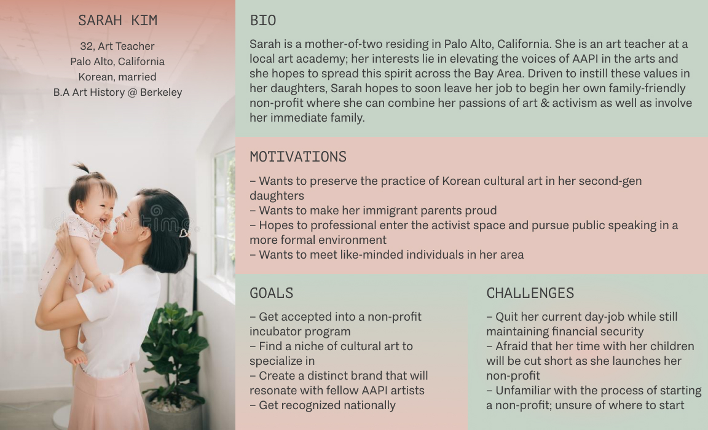
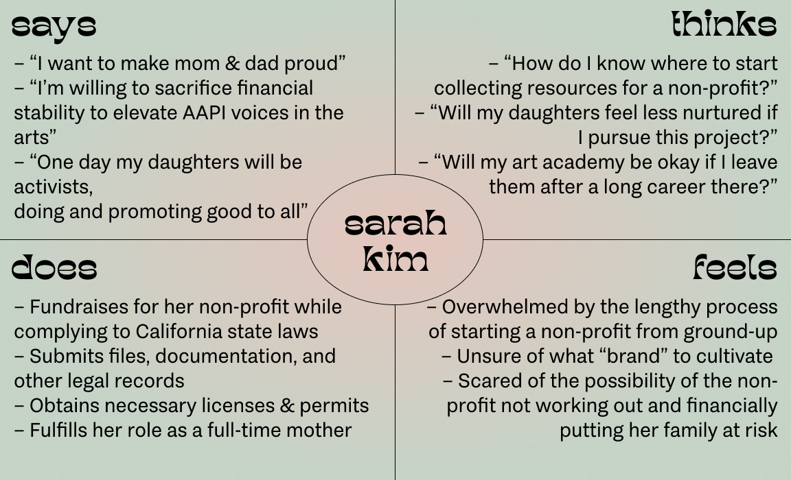
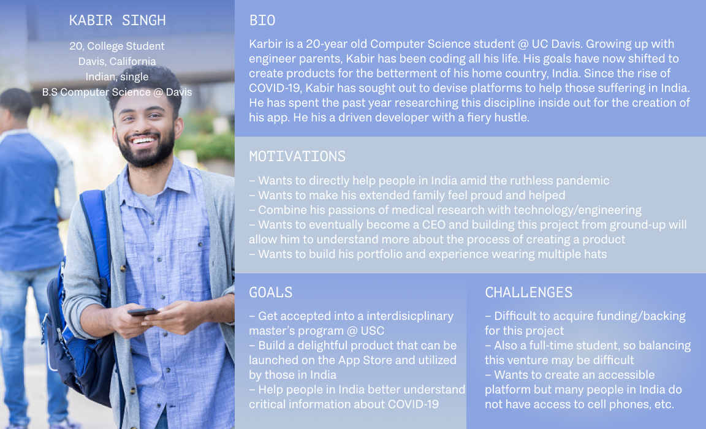
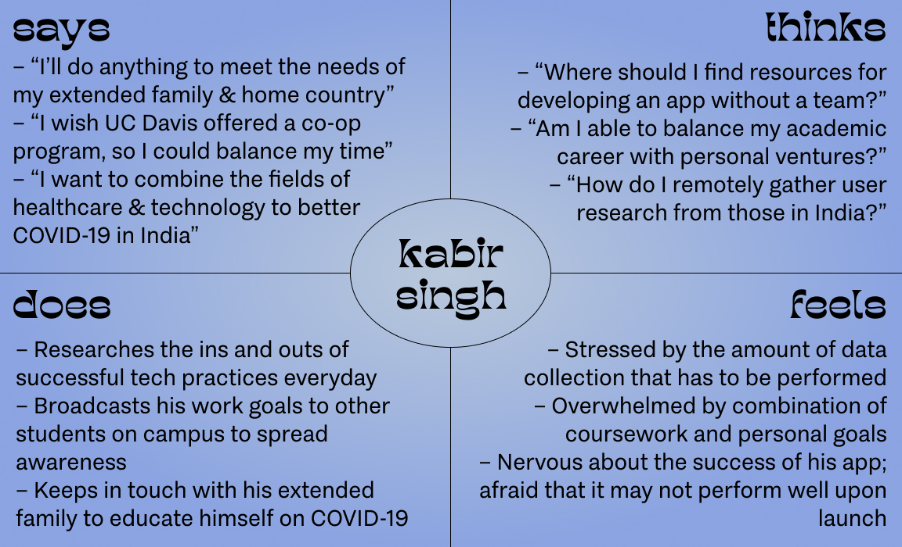

DH 110: Assignment #4
UX Storytelling

## The Purpose of UX Storytelling
UX storytelling is an instrument to be wielded with great purpose and intention – it allows us to holistically consider the perspectives of users in order to come to unbiased insights into the product or experiences under observation. The process of UX storytelling spans digesting the user's perspective in order to step into their shoes of how they view the product in question and examining how they would utilize said product. Storytelling holds a breadth of human emotions – it gives us an understanding of the user's identity, culture, and unqiue set of life experiences. Rather than narrowly viewing every design challenge as a problem-solving exercise, UX storytelling encourages empathizing with users in order to create delightful, intentional products. 

## Personas & Empathy Map

### Persona 1: Sarah Kim - Loving mother, activist, and cultural artist

### Persona 2: Kabir Singh – Data-driven developer & full-time student

## Scenarios & Journey Map
> These scenarious are centered around the Californian government's website, specifically its categories pertaining to documentation & licensing associated with starting a business.

### 1. Sarah's Scenario & Journey Map
#### Why Sarah is using this product

> Sarah is beginning her non-profit ventures, a process that comes with a great deal of documentation, licensing, and most importantly, state approval. At a recent non-profit fair, Sarah chatted with those who have been involved in the non-profit space for much longer and they advised her to begin her journey by filling out government paperwork and adhering to state laws. Feeling very overwhelmed by the legalities of her non-profit's first steps, Sarah took to utilizing the California government website, specifically seeking answers to her questions through the "Doing Business" sub-page. She is initially frustrated by the sheer number of available resources – which set of documents are tailored to her specific set of questions? However, after diving deeper into the website's collection of comprehensive guides & paperwork, she stumbles across the resources for charity/non-profit work, the niche that she is working within. This page breaks down to her the exact steps she needs to follow as she fills out paperwork and files for approval.

#### How Sarah is using this product
> As an art teacher, Sarah is not very familiar with technology, especially the crude interface of the government website. In order to ensure that she makes appropriate and efficient use out of this software, she seeks help from her husband, John, a software engineer who is well-acquainted with technology. John helps her navigate this site in alignment with the resources she is seeking: drafting and filing the articles of incorporation, appointing the board of directors, drafting the bylaws and conflict of interest policy, and filing the Statement of Information (Form SI-100) with the Secretary of State. Sarah begins by downloading all of the necessary paperwork from the websites, most of which are in pdf form, and filling them out with her non-profit team. She then scans these documents and uploads them to the state's portal, submitting them for approval and waiting to hear back from the state so she can pursue next steps. Clicking around th website was draining and difficult for her, as she felt that many of the documents were hidden within sub-pages, making them highly inaccessible. She doesn't feel as though she would have been able to locate all the necessary information had it not been for her husband's assistance. 

### 2. Kabir's Scenario & Journey Map
#### Why Kabir is using this product
> Since his childhood, Kabir has dreamt of pursuing a career in engineering – watching his parents work at some of the biggest tech companies in the world, he's always been driven to utilize tech for greater good. He has also grown up very close to his Indian heritage, which is something that constantly inspires him to vouch for public health issues in his home countruy. After the destructive outbreak of COVID-19 in India, Kabir felt compelled to build a platform and brand to help people in his home country through his data-driven concepts. Upon nearly 8 months of ideation, Kabir concluded that he'd develop a platform to update Indian citizens on available vaccine appointments, ways to obtain free masks, and other COVID-related information. While building the app, he fed parts of his life-long dream of being a CEO and was motivated to establish his platform as an official business. With research, Kabir found that he would have to go through an intricate process with the state of California to declare his platform a business, which is what led him to the government website, specifically for its business establishment resources.

#### How Kabir is using this product
> As an avid technology user and a computer science student, Kabir is beyond adequate when it comes to the use of government websites, even those with crude interfaces, like the ca.gov site. To begin the establishment of his platform as a business, Kabir turns to the "Apply for Business License" service, under which he clicks "Launch Service" and creates an account with the ca.gov site. Upon creating an account and following through with the multi-factor authentication, Kabir is led to the various downloadable paperwork files on the government website. These files include: Registering his business with the California Secretary of State, obtaining his EIN Number (Federal Tax ID Number), opening a business bank account, and registering for taxes. Similar to Sarah's experience with ca.gov, Kabir downloads the various necessary pdf files, fills them out with the help of others (the bank, his parents, etc.), and submits the legal work via the ca.gov submission portal. Eager to hear back from the state to see if his paperwork was approved, Kabir prepares himself to soon complete final steps and get to legally and officially establishing his business.

## Reflection
While an extremely exciting and compelling project to take on, this assignment definitely took more patience and ideation than I had anticipated. As I followed through the steps of the assignment, I was constantly pushed to realize the sheer intricacies of human life and the nuances that comes with each being's persona. UX storytelling is such a holistic, tasteful process, and it is one that I will surely never take for granted in the future. This assignment has easily been my favorite out of the ones we have completed thus far and it has induced in me a skill that I look forward to working on throughout my career.
