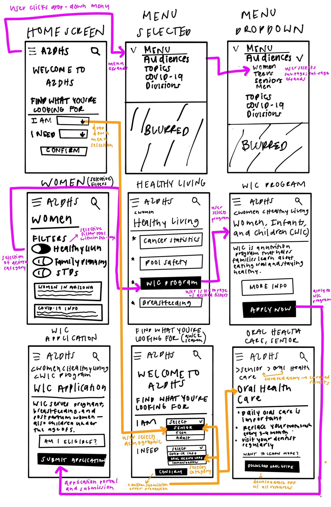
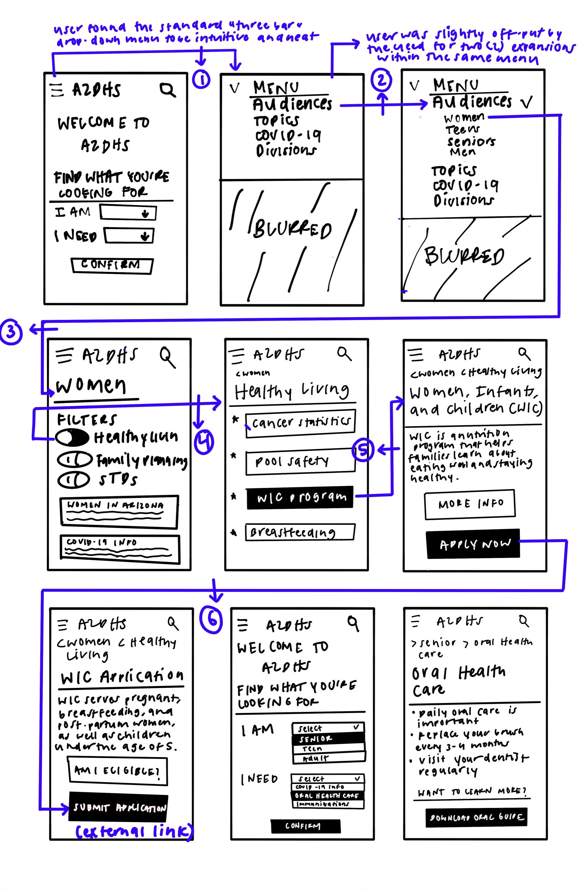

Assignment 05: Low-Fidelity Prototypes

# Arizona Health Services Accessibility for Public Health

## Preface + Purpose of Low-fidelity Prototyping
Throughout the course of the past few assignments, I've gone through the motions of conducting research and collecting data for the creation of my platform. In this assignment, I will be applying my research to low-fidelity prototypes and bringing systematic & fundamental features within my platform to life. Low-fidelity prototyping is a rapid manner by which to test potential features of a product with a target audience member prior to fully investing time and money into the fruition of said functionalities. The process of low-fi prototyping is crucial to receiving preliminary feedback from members of the target audience and allows for a iterative visual and systematic design process. Through the use of lo-fi prototypes in my project, which is centered around making public health resources in Arizona accessible to all, I can prematurely test design features with users before moving onto high-fidelity solutions.

## Wireframes + Wireflows

Below are the wireframes + wireflows I created for my platform and utilized for my user testing. The arrows between the wireframes depict the flow, while the wireframes hold the technical and cognitive functionalities of two tasks.

> - Task 1: Finding information with "Find What You're Looking For" (quick search) function – triggered by clicking drop-down menus
> - Task 2: Narrowing resources with selective demographic + topic filters – triggered by clicking main navigation menu

## Testing

Since I drafted these wireframes via digital drawing tools, I conducted my test in-person and had my participant navigate through the two (2) tasks on the raw wireframe files. I carefully observed my participant's decisions, journey, and movement, and was able to track them in the form of the below tests. Prior to conducting the test, I briefed the two (2) tasks to my participant and provided a step-by-step explanation of what they would be navigating and other features that they should be prepared to interact with.

> ### Task 1 (Red flow)
> - Navigate to "Find What You're Looking For" (quick search function) on home page
> - Select respective group ("I am", Senior) and category of resource ("I need", Oral Health Care) being sought out
> - Learn more about selected topic and save downloadable pdf guide with comprehensive information

### Task 2 (Blue flow)
> - Navigate to top menu/main navigation bar
> - Expand "Audiences" page, select respective group (Women)
> - Turn on appropriate filters (Healthy living) and locate desired information (WIC Program)
> - Learn about program and apply

## Reflection
My user test went much smoother than I had expected – my participant was able to navigate through the two (2) tasks I assigned them (relatively) efficiently, which was rewarding for me to observe given that this was their first time interacting with these flows. However, there is always room for error, and this inevitable fact manifested itself in a few hiccups along the journey of my participant.
> -
> -
> -

Overall, crafting and testing these wireframes + flows was an enriching experience that has proven to be critical to the construction of my platform. This assignment has pushed me to value laying the groundwork prior to tackling any high-fidelity visual design solutions; working on a lo-fi scale has allowed me to craft iterative solutions and work flexibly by the needs of my users, which is a fundamental part of building delightful experiences that can truly have tangible impacts.
