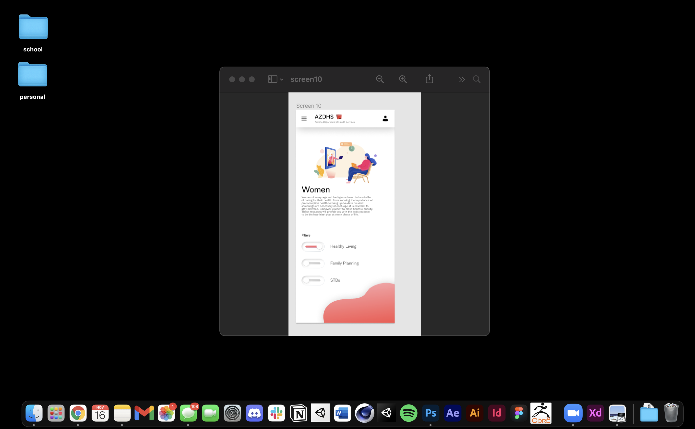

#### Assignment 06: Interface Design
# Government Support for Public Health Accessibility in Arizona

## Preface

Throughout the course of the past several assignments, I've built the foundation for my proposed website, which will provide Arizonans wih an interactive experience to navigate a masterlist of information and resources pertaining to public health accessibility in Arizona for a range of demographics. In my previous assignment, I layed down a low-fidelity exploration of this website, which served as a guide throughout the interface design of the website. In this assignment, I will be focusing on visual and aesthetic values of my website, including typography, color contrast, button shapes, and more. I will also be conducting an impression test to better understand the most user-ideal design variation. 

## UI Design + Interactive Prototypes
Below, I have attached screengrabs of the fourteen (14) working screens in my current interactive prototype, which have been designed in accordance with the low-fidelity wireframes I outlined in [Assignment 5](https://github.com/anika1222/DH110-2021F/blob/main/assignment05/README.md).

To view the interactive prototype and access my Figma design files, please refer to [this link](https://www.figma.com/file/28aljV2zzpYVg1TaFEatCN/Interface-Design?node-id=0%3A1). In order to activate the clickable prototype, please press the "Play" button in the top right corner.

### Layout Design

The screengrab below depicts the homepage's relation to the grid system we discussed in class, specifically a 6x10 grid that I set up to allow for readability and flexibility across the design system.

### Typographic Variations (3)

Given that my platform is centered around distributing information and making resources accessible, I deemed typography to be a critical component of the design system. Below are three (3) typefaces that I explored throughout the creation of these interactive prototype. From left to right, the typefaces in the screengrabs below are: Albra Grotesk, Passenger Sans, and Aktiv Grotesk. I chose to solely vary between sans-serif faces because of the adherence to modern and minimalistic design that I wanted my website to uphold.

### Shape Variation (3)

My website is comprised of numerous buttons across the various screens, so I wanted to choose a button shape that would align with my platform's design values, as well as serve basic roles of acccessibility and efficiency. From left to right, the three shapes I explored are: Capsule, square, and teardrop. I chose these three shapes to provide my user with two drastically different choices, as well as a comfortable middle-ground.

### Color Variation (2)

In order to lay down the groundwork for a truly accessible platform, I created both a light and dark mode design system for my website. Given the brighter color palette I'm working with, making iconography + illustrations stand out in both modes was fairly easy. For the dark mode system, however, I chose to use dark grays rather than a stark black in order to reduce eye strain, while still creating contrast between the visual elements. 

## Impression Test

I conducted the impression test portion of this assignment via Zoom by screensharing each variation, one window at a time. The participant of this test requested to not be recorded, so to preserve their anonymity, I instead took detailed notes on their impressions of the website's various features and system variations to better inform my design process. These notes will be summarized in the below sections.

In order to eliminate any potential bias from the impression test, I removed all details from the original Figma frame files (frame title, design assets, font style, etc.) and had my participant examine the type, shape, and color of the design system part-by-part. I informed him of what he could expect in each section (to guide his attention) and asked him about his preferences after observing each section.

### Font

Beginning with the font section of the impression test, the participant said he preffered Albra Grotesk because of its readable geometry, letter spacing, and thickness. Unlike Passenger Sans, which he said was too thick at the "Medium" style, and Aktiv Grotesk, which had less readable letter spacing, he found Albra Grotesk to be a happy medium for a government-based public health platform.

### Shape

In regards to the button shape, the participant strongly preffered the capsule shape over the other two options. He found the square shape to be too stark and felt it looked out of place on this platform, especially when paired with the rounded typography. While he enjoyed the teardrop shape, he found it to be more of a novelty button that would not realisticly align with the design values of a government platform.

### Color

When comparing light mode to dark mode, the participant favored the light mode significantly due to the ease of readability. Like the other portions of this impression test, this preference was purely personal, as the participant solely uses light mode on her own devices and strays from dark mode. She found the contrast between the text and background screen to be too harsh in dark mode, making it harder on the eyes.

### Results and Decisions

After conducting a comprehensive series of tests, I was able to come to a curation of design elements to incorporate into my final system. Based on user feedback, the final decisions I came to were: Albra Grotesk pt. 24 (typography), capsule button (shape), and light mode (color). As I continue developing this design system, I will be reffering to user feedback in order to tailor my website to user-centered standards and make it accessible to all.

## Accessibility Test

To test the accessibility of my website, I ran both the light and dark mode variations under Figma's Stark plugin. As can be seen, the dark mode variation met the WCAG2.0 AA and AAA standards, while the light mode will require some adjustments in color contrast, which I will iterate in future working files.

## Reflection

This assignment, like others, was an enriching experience that allowed me to build a more personal connection with the website I'm building. I found this step of the process to be the most formal and bringing lo-fi ideas to life made the platform more tangible and feel a lot more intentional. There were a lot of factors that I had not considered while going into this specific design process, and workinh iteratively in order to close any holes was vital to the outcome of the interactive prototypes. While I gained a lot of individual understanding from the exploration of various fonts, shapes, and colors, I was able to truly gain a lot of insight throughout the impression test, which reaffirmed to me the importance of user input and feedback. I look forward to implementing design descisions based on user research in future prototypes of my website.=
