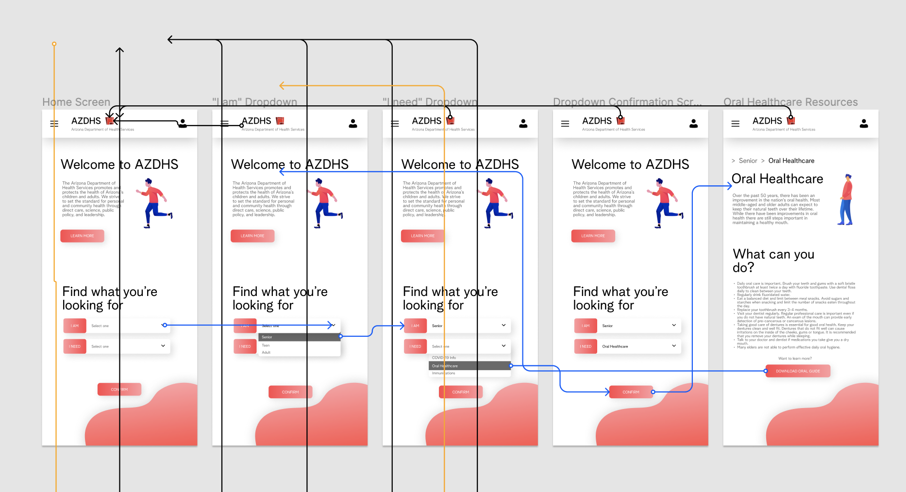
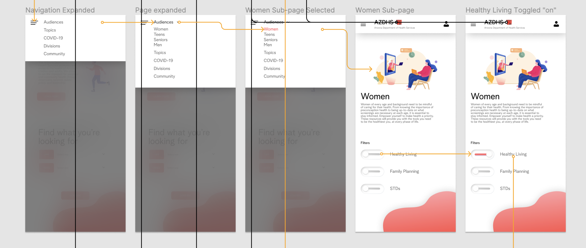
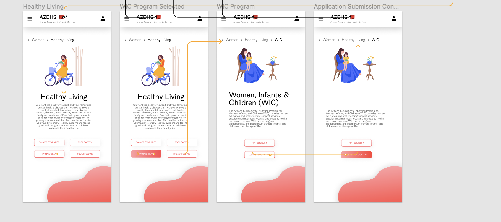

#### Assignment 07: High-Fidelity Prototype
# Government Support for Public Health Accessibility in Arizona

## Preface

In preparation for the fleshed out, working prototype of my proposed website, I layed down the groundwork through a series of assignments tackling each stage of the design process. Previously, in Assignment #6, I constructed a functional design system and conducted an impression test to receive feedback on my website's UI design and other visual elements. To implement the user input I gathered from this test, I have built a functional and viable high-fidelity prototype that I will be detailing throughout this assignment. As I'm nearing the final stages of the design process, I will be using this assignment to understand the essence of my platform, which will be guided by a cognitive walkthrough in order to test the functionality of my website with users. I hope this test allows me ti gain clarity on final iterations that must be implemented into the design system prior to compeletion.

## Interactive Prototype

To view my Figma file and interactive prototype please click [here](https://www.figma.com/file/1vvIcMtxdu8Yr9WSCAGG6w/Interactive-Prototype?node-id=0%3A1). In order to interact with the prototype, please click the "play" button in the top-right corner.

*I want to note that the interactive prototype does not support every possible action on the website, just the two tasks detailed below:* 

**Task 1: Finding curated resources by demographic & topic with quick search tool**

- Accessing desired resources efficiently rather than sifting through the dense website 
- Utilzing drop-down menu to select demographic (Women, Teens, Men, Senior) and desired topic (COVID-19 info, Oral Healthcare, Immunizations, etc.)
- Confirm selections with confirmation button to ensure selected categories are correct
- Sorting curated information for each group
- Apply filters to different sub-topics to ensure most efficient delivery of resources and necessary information 

**Task 2: Finding specific information within a sub-page with filter tool**

- Accessing sub-pages through interactive drop-down menu
- Apply selective filters (Healthy Living, Family Planning, STDs, etc.) on sub-page to curate resources/articles accordingly and make page more readable
- Toggling multiple filters at once to view information pertaining to individual needs
- Displaying intuitive map of user's journey through sub-pages to validate position on site

Both tasks start and end at the website's homepage (the downloadable oral healthcare guide and application submission buttons are still being developed; the final prototype will not have the tasks ending back at the homepage, but rather, two external pages).

## Wireflow with Interface Design

To view my Figma wireflow file, please click [here](https://www.figma.com/file/EwlCXvhGdReVQMCB6gSxpU/Wireflows?node-id=0%3A1) or refer to the screengrabs provided below. Please note that the wireflow is not intended to be interactive (unlike the interactive prototype which is linked in an above section of this assignment), but rather as a guide for the flow of each task. The key for the colored flows is as follows: the black flows indicate all potential actions that can lead the user back to the hompage, the blue flows indicate Task #1 (quick search tool), and the orange flows indicate Task #2 (quick filter tool).

## Cognitive Walkthrough

Prior to conducting the coginitive walkthrough portion of this assignment, I made some fundamental changes to the ideation of my website based on feedback from our in-class impression test, which I plan on iteratively implementing throughout the completion of the final prototype. The changes I plan on making include: creating a user portal so the profile icon can be of use, adding a "Learn More" page so the button on the homepage is clickable, and changing the irregular shape at the bottom-right corner to something less distracting/large. I was unfortunately unable to implement these specific changes during this cycle of iteration, as I was more focused on the functionality and flow of the website, but in order to receive maximum user input, I aim to host another cognitive walkthrough with the new iterations prior to proceeding with the final prototype.

Upon deciding which revisions to make, I conducted a cognitive walkthrough with a participant. My participant requested to not be recorded/monitored for privacy reasons, so to collect data, I took notes on their experience as I walked them through the interactive prototype. The test consisted of me showing my participant the prototype and asking questions about what he intuitively believed would be the appropriate object to click at every point of his journey. Similar to my previous assignment, I aimed to eradicate any potential bias by not sharing any information about the user journeys, as well as not indicating where to click next. I began the test by posing general questions about what he might believe to be the purpose of the website and his experience with government websites, to which he correctly noted my website as the public health branch of the Arizonan government and shared some anectodes about his personal experience with other government services/websites. 

I then proceeded to walk my participant through the two (2) sets of flows/user journeys, which was an efficient and smooth-sailing process. My participant was able to appropriately identify where to click at almost every given point of his journey and was confident in his decisions, which reaffirmed to me the intuitiveness of certain button placements. However, during his course of navigating the first task, he did get a little stuck when the downloaded oral healthcare guide led him back to the homepage, but this issue was quickly resolved when I explained that this was the right journey based on the current flows I have created. My participant's ease of navigation and certainty of actions was reassuring and helpful feedback. While this test went well, I will be conducting another walkthrough with a different user to test the next set of iterations and gain a more holistic, objective understanding of the journeys involved in my website's tasks.

## Reflection

Each step of this design process has been greatly valuable to not only my understanding of user-centered design, but also the goals of my own platform. The high-fidelity prototypes I created for this assignment were critical to completion of the final steps of my website, and were undoubtedly the most rewarding components of the design process. After weeks of ideation and low-fidelity sketching, it was fulfilling to click through my website and test its functionality. The culmination of all the unique user perspectives I've gathered to this point of the design process was evident in these prototypes and I am excited to tackle the final revisions of this platform.
