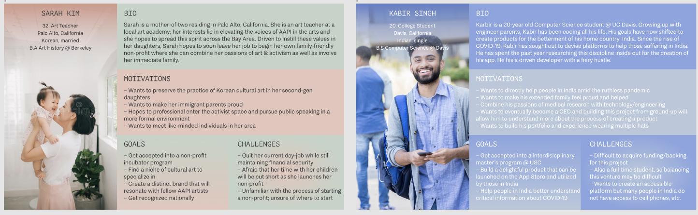

# Government Support for Public Health Accessibility in Arizona

## Anika Murthy

### Preface

Throughout the course of this quarter, I methodically approached the creation of the Arizona Department of Health Services Hub platform. This app is centered around increasing accessibility of public health resources and other forms of information to all Arizonans. In early 2020 when the COVID-19 pandemic wreaked havoc on the public health of our nation, it became clear that the only way to maintain widespread health and control would be through the ready access of health resources to increase awareness and educate crowds. Changes as such begin within immediate communities, which is why I chose to craft a catch-all public health resource access app for the state of Arizona. The Arizona Department of Health Services Hub platform was built with a goal to cater to all demographics within Arizona and provide direct access to health guidelines, informational pamphlets, and local programs to increase awareness, as well as build a relationship between community and healthcare equality. This app is meant to serve a wide range of ethnic groups and ages and its built in a manner by which to satisfy all potential users. Upon performing initial competitor analysis, conducting countless rounds of user research, and following an iterative prototyping process, I came to a high-fidelity solution to make public healthcare readily accessible to Arizonan citizens.

### Design Statement
This platform was designed to solve the issue of scattered and inaccessible healthcare resources across the current Arizonan government websites. The goal of my platform is to remedy this issue by meticulously organizing decades of healthcare resources by demographic and topic to encourage Arizonans to become aware of healthcare guidelines, as well as provide the opportunity for those without health insurance to accesss state-mandated public health information. By making the process of healthcare resource access more organized and intuitive, I hope to raise awareness within immediate communities to foster a long-term goal of respecting public health guidelines.

### Competitor Analysis

In order to support and further my understanding of how existing Arizonan health platforms operate and appear, I sought out to perform a competitor analysis on two government websites: [The Arizona Department of Health Services](https://www.azdhs.gov/index.php) & [The Department of Environmental Quality](https://azdeq.gov/). By utilizing [Jakob Nielsen's 10 general principles for interaction design](https://www.nngroup.com/articles/ten-usability-heuristics/) as a guide, I evaluated the the usability issues within the two aforementioned platforms and how the application of these heuristics played into the overall accessibility of health resources. While both of these websites served their goals, this analysis revealed both global & minor usability issues that created an inaccesibility in public health information.

Upon diagnosing these usability issues, I called in a participant to conduct a [pilot usability test](https://github.com/anika1222/DH110-2021F/blob/main/assignment02/README.md) in order to understand the experience presented by the platform from a user's perspective. The test consisted of my participant completing a series of guided tasks, each relating to the usability issues that had been defined earlier, while simultaneously leaving room for the discovery of flawed areas that I had previously missed. As predicted, the pilot test resulted in my participant shedding light on many problematic sectors of the website that I had left unnoticed, which further assisted my process in determining what needed to be improved upon in my platform. This step of the design process helped me better understand the value of a holistic user's perspective, which was a core principle which remained central to my workflow throughout the creation of my app. 

### User Research

To polish my understanding of general user impressions of pre-existing websites, I proceeded to conduct a [contextual inquiry](https://github.com/anika1222/DH110-2021F/blob/main/assignment03/README.md) with a target audience member, in which I posed questions regarding information accessibility and general perspective of obtaining resources within a metropolitan city. I utilized the insights of my participant to streamline the onboarding experience of my app, as he emphasized the importance of onboarding as a factor in determining a website's accessibility.

###  UX Storytelling

With all of the previous research under my belt, I had a goal of better understanding my app's target users prior to moving onto the wireframes and cosmetic displays. In this step of the process, I created two [user personas](https://github.com/anika1222/DH110-2021F/blob/main/assignment04/README.md) and explore their respective narratives, the formulation of which being creatively-taxing and difficult, but inevitably strengthening to my understanding of nuanced user needs. Experimenting with the personanas allowed me to center in on my app's main featues and determine what I wanted to include in coming wireframes.

### Wireframes and Graphic Design Element Variation

To begin my visual design process, I utilized my finds from user research, testing, and proposed personas to build out simple sketches of what my platform might be built out as. The [wireframes](https://github.com/anika1222/DH110-2021F/blob/main/assignment05/README.md) gave me the opportunity to visualize how my concepts could fit on a digital platform and challenged me to experiment with various layouts and design assets to reach my target audience through my platform's design/

### Low-Fidelity Prototype + Graphic Element Variation

Using my sketched wireframes as a guide, I moved onto creating a set of [low-fidelity prototypes](https://github.com/anika1222/DH110-2021F/blob/main/assignment05/README.md), which included the first prototypes of my app's twp (2) main features: Find What You're Looking For (quick search) function & the selective filtration tool. These wireflows pushed me to consider what action would lead to the next and the interconnection of my app's visual components. I recruited a participant to, once again, help me illuminate usability issues, but to my validation, my participant only uncovered minor issues which were improved upon in the following iterations. 

Upon testing my low-fidelity prototype, I took to Figma to create my first set of [mid-fidelity interface designs](https://github.com/anika1222/DH110-2021F/blob/main/assignment06/README.md). These designs were critical to understanding the graphical components my app required and gave me a chance to colorize the platform's various facets. At this point of the process, I had not made final design decisions, but rather, was testing various typefaces, button shapes, colors, etc. Testing each variation with a potential member of my target audience was critical to determining to visual flow of the app as well as its aesthetic motifs.

### High-Fidelity Prototype

To synethesize my research and my design iterations, I moved onto the final step of my design process – [high-fidelity prototyping](https://github.com/anika1222/DH110-2021F/blob/main/assignment07/README.md). This prototype is fully-functional and interactive, supporting users in the two (2) aforementioned accessibility features. With the use of Figma, I implemented flows between each screen and came to my final screens. The final prototypes are embedded below, as well as viewable [here](https://www.figma.com/proto/1vvIcMtxdu8Yr9WSCAGG6w/Interactive-Prototype?scaling=scale-down&page-id=0%3A1&starting-point-node-id=2%3A2&node-id=2%3A2). 

<iframe style="border: 1px solid rgba(0, 0, 0, 0.1);" width="800" height="450" src="https://www.figma.com/embed?embed_host=share&url=https%3A%2F%2Fwww.figma.com%2Fproto%2F1vvIcMtxdu8Yr9WSCAGG6w%2FInteractive-Prototype%3Fscaling%3Dscale-down%26page-id%3D0%253A1%26starting-point-node-id%3D2%253A2%26node-id%3D2%253A2" allowfullscreen></iframe>

Upon completion of my prototype, I moved onto a [cognitive walkthrough](https://github.com/anika1222/DH110-2021F/blob/main/assignment07/README.md), during which I tested my platform's strength on my participant's ability to navigate the interface and its various sub-pages and tabs. The participant was able to have a smooth journey through the platform and left me with positive feedback.

*++ *I want to note that the high-fidelity prototypes documented in Assignment 7 are inaccurate when compared to the live Figma link with the interactive prototype. Since Assignment 7, I took into account comments from my instructor, Professor Sookyung Cho, to better the UI/UX principles of my app. Please refer to the Figma file to view the final modified version, as well as observe the changes that have been made since Assignment 7* ++*

### Pitch Video

You can view my pitch video [here](x).

### Conclusion

The course of this project was quite non-linear and there was definitely a learning curve to the consolidation of my research and making sure to implement all the necessary, appropriate changes based on user feedback. Throughout the course of this project, I was able to navigate an end-to-end UX design process with the creation of a specific platform in mind. As I started to tackle each assignment and slowly build out the app, I didn't quite see the bigger picture. Each step of this process was so microcosmic and felt so rich in information that I couldn't believe it wasn't a project of its own. It was when I started creating visual mockups and laying out the app in color that I synthesized the learnings from our array of assignments and saw how they fit into the grand scheme of things.

As a design student, I am familiar with a variety of software and work with design on a daily basis, regardless of what form. However, even as a practicing designer, this project challenged me in a positive way as it encouraged me to make very intentional design decisions and follow an iterative cycle for something as seemingly "trivial" as the geometry of a button. Approaching design in such an intentional manner was inspiring – it was very nice to hone in on particular elements and consider their respective impacts on the bigger picture.

As a UX designer, this project evoked great amounts of user empathy within me and truly allowed me to understand the importance of taking into account the user perspective. I think that it's quite easy to encounter stuborness in the design world – it is easy to be so narrow-minded that you believe that there cannot possibly be another manner by which to mitigate a problem. Following the comprehensive, data-driven UX design process throughout the creation of this app has been vital to my empathetic drive. 

Overall, this was a very rewarding project that left me with great takeaways and knowledge about the user-centric principles of design. I'm satisfied with my final prototype and believe that within the time constraint, it performs exactly what it needs to. In the future, I would love to devote my time to whole-heartedly building this app out and developing an intricate design system for it.
